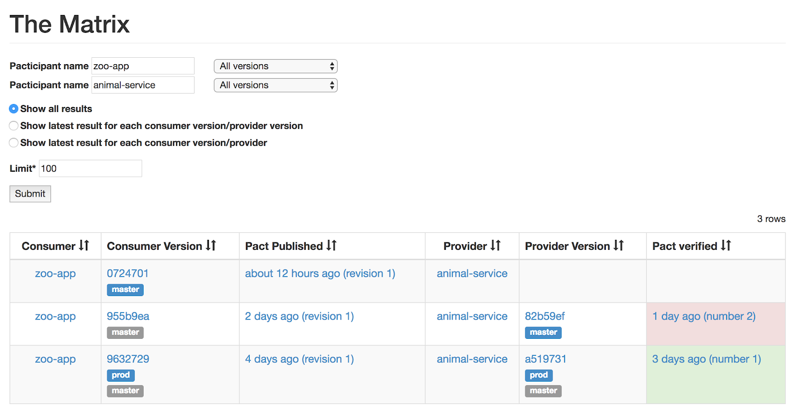

# Effective Pact Setup Guide

Or _"The steps for reaching Pact Nirvana"_

This is a technical guide for developers who want to use Pact to implement consumer driven contract testing.

By the end of the guide, you will understand how to create a release pipeline that allows you to independently deploy any application with the confidence that it will work correctly with the other applications in its environment - without having to run a suite of end to end tests.

Although many guides assume a greenfields project with no existing code, this document is intended to also be useful for retrofitting Pact into an existing project.

Before you read this document, you should:

* have a basic understanding of the concepts of both [consumer driven contracts](https://martinfowler.com/articles/consumerDrivenContracts.html) and Pact,
* have read the [Pact Broker Overview](https://github.com/pact-foundation/pact_broker/wiki/Overview)
* have read the section on [Pacticipant version numbers](../getting_started/versioning_in_the_pact_broker.md)

### How to use this document

Each integration is different. Each organisation has different history and culture, and each team may have different processes for development, testing, and deployment. Each of these differences affect the best choices for Pact workflow.

However, there are many similarities in the steps necessary on the journey to a full-featured and effective Pact setup \(_"Pact Nirvana"_\). This document describes those steps.

Feel free to pick and choose the steps that apply best to your team. You may implement only the first few steps described below, and just use Pact as a precursor to your standard integration tests; or you may throw away your integration tests altogether and reach “Pact Nirvana”.

As Pact has been implemented in many different languages, this document will outline the theory for each step. You will need to consult the documentation of your chosen language to learn the relevant syntax for each task. See the [implementation guides](../implementation_guides/) section for more information.

### What are the steps for reaching Pact Nirvana?

1. Talk
2. Spike \(Optional\)
3. Write and verify a real Pact
4. Automate the contract and verification results exchange
5. Allow contracts to change without breaking your builds
6. Use tags to ensure your provider is compatible with your production consumer
7. Use The Pact “Matrix” as a gateway to deployments
8. Prevent missing verifications

## 1. Talk

Contracts are not a replacement for good communication between or within teams. In fact, contracts require collaboration and communication. One could make the argument that this is one of the main reasons to leverage Pact and enforce communication pathways in large internal and external development organizations.

Contracts are not a magical silver bullet that will allow you to hide in your developer caves and toss built artifacts at each other until everything passes. It is important for all teams to be invested in the process.

Collaborate about the problems, collaborate over the design, and keep the communication channels open.

## 2. Spike \(Optional\)

If you have not used Pact before, consider trying it out on a [spike](https://en.wikipedia.org/wiki/Spike_%28software_development%29) application first.

1. Using the technology stacks of your consumer and provider

   respectively, write a consumer test for a single endpoint \(eg `GET /helloworld`\).

2. Generate the pact file.
3. Send it to the provider team. This doesn't have to be fancy, you can just email the file.
4. Get the provider team to implement the provider, and verify the pact.

Next, you could try adding provider states and matchers. Make sure you understand how the pact generation and verification steps work.

## 3. Write and verify a real Pact

The hardest thing about setting up Pact in any company is getting buy in from all the teams. Everyone needs to be on the same page to make Pact work.

A good way to determine if Pact works for you is to write and verify a pact for a real consumer and provider.

1. Write a Pact test in your consumer project \(consult [the documentation](../implementation_guides/) for your

   chosen language\) and generate the pact.

2. Ship the pact file to the provider team - it still doesn’t matter how yet, we’ll get on to that in the next step.
3. Verify the pact against the provider \(again, consult the documentation for your chosen language\)
4. Talk about it.
5. Decide whether or not Pact is the right tool for you, taking into account that there are situations for which Pact is [a good solution](https://docs.pact.io/faq/#what-is-pact-good-for), and situations for which Pact is [not a good solution](https://docs.pact.io/faq/#what-is-pact-not-good-for).

## 4. Automate the contract and verification results exchange

Now you have two different sets of tests in two different codebases. The artifacts that tie these tests together are the Pact file, and the verification results. The next step is to automate the exchange of these artifacts.

The [Pact Broker](https://github.com/pact-foundation/pact_broker) is a service that allows your projects to exchange pacts and verification results in an automated way.

While you can use Pact without a Pact Broker, using one allows you to get the most out of Pact. Without the Broker, you will have to work out how to create your own feedback loop that lets you know the results of the pact verifications, and your pacts will not enable to you release your services independently and safely using the `can-i-deploy` tool \(more on this later\).


**Quick Start**

The Pact Broker is an open source tool that requires you to deploy, administer and host it yourself. If you would prefer a plug-and-play option, we've created [Pactflow](https://pactflow.io/?utm_source=ossdocs&utm_campaign=effective_pact_setup), a fully managed Pact Broker with additional features to simplify teams getting started and scaling with Pact.

Get started for free on our [Developer Plan](https://pactflow.io/pricing/).


### A. Set up a Pact Broker

1. Read the Pact Broker [home page](https://github.com/pact-foundation/pact_broker), \(taking note of the various deployment options available to you\) and the [quick start guide](https://github.com/pact-foundation/pact_broker/wiki#quick-start-guide), or sign up to a hosted Developer plan at [Pactflow](https://pactflow.io/).
2. Deploy a Pact Broker to a network that has access to both consumer and provider CI systems so it can trigger builds.

### B. Configure pact publication

1. Configure your consumer build to run the Pact tests and publish its pact to the Broker as part of its main build \(consult the documentation for your chosen language\). Consumer Pact tests typically run after the unit tests, and before deploying to a test environment.

### C. Configure pact to be verified when provider changes

1. Configure your provider build to fetch the pact from the broker and publish the verification results as part of its main build \(consult the documentation for your chosen language\). This would typically happen after the unit tests, and before deploying to a test environment.

### D. Configure pact to be verified when contract changes

1. Create a new CI job that performs just the provider pact verification step for a given pact URL \(consult the documentation for your chosen language for how to configure this\). The job should accept the URL of the changed pact in the HTTP request parameters or body.
2. Configure a [webhook](https://github.com/pact-foundation/pact_broker/wiki/Webhooks) to kick off the provider verification build when a pact changes, and use [webhook templates](https://github.com/pact-foundation/pact_broker/blob/master/lib/pact_broker/doc/views/webhooks.markdown#dynamic-variable-substitution) to pass the URL of the changed pact to the build.

As you have two different builds running the pact verifications \(one when the provider changes, one when the contract changes\) it is best to use a provider version number that is deterministic \(eg. does not include your CI build number\) so that a verification from either job is recorded with the same version number. This will help you when it comes to using the `can-i-deploy` tool in step 7. Please read the section on [versioning in the Pact Broker](https://docs.pact.io/getting_started/versioning_in_the_pact_broker) to ensure your version numbers will help you get the most out of your Pact Broker.

Useful links:

* [Installing a Docker Pact Broker](https://hub.docker.com/r/pactfoundation/pact-broker)
* [Publishing verification results](https://github.com/pact-foundation/pact_broker/wiki/Provider-verification-results)
* [Configuring webhooks in the Pact Broker](https://github.com/pact-foundation/pact_broker/wiki/Webhooks)
* [Adding verification badges to your READMEs](https://github.com/pact-foundation/pact_broker/wiki/Provider-verification-badges)
* [Versioning in the Pact Broker](https://docs.pact.io/getting_started/versioning_in_the_pact_broker)

## 5. Allow contracts to change without breaking your builds

You now have a workflow where:

* A pact is published with every consumer build
* The latest version of that pact is verified with every provider build
* The verification results are published back to the broker
* Any change to the pact triggers a provider build

One of the complications introduced by the "consumer driven" nature of the workflow is that new interactions are usually added to the contract before the functionality has been implemented in the provider. Using the workflow described above, a provider build will be kicked off when you publish a contract with new interactions in it. This build will \(correctly\) fail during the verification task. This is not ideal, as the failure is expected. To solve this, we need to allow contracts to change without breaking the builds.

"Tagging" application versions in the broker allows you to introduce new expectations to a pact without breaking your provider builds. Tags are simple text labels that are applied to application versions, and you can think of the time ordered series of pacts that belong to each tag as forming a "pseudo branch". These psuedo branches can be used in a similar way to git feature branches, where you can keep an unbreaking stable line of development, while adding new, breaking interactions on the side.

To achieve these "pseudo branches", when a pact is published, the associated pacticipant version should be tagged with an identifier that will be used by the provider to differentiate between the stable, safe pacts \(eg. tagged "master"\) and the potentially breaking pacts \(eg. tagged "feat-new-foobar"\).

To keep a green build, in your provider’s CI only verify the pact for the latest version tagged with the name of the stable tag, rather than verifying the latest overall pact.

If you use feature branches for your consumer development, it is recommended to tag the pacticipant version with the name of the branch. If you use feature toggles, the tag could be the name of the feature toggle. The [Pact Broker CLI](https://github.com/pact-foundation/pact_broker-client#create-version-tag) tool can be used to create tags easily.

1. Configure a tag name to be used for every consumer build that publishes a pact \(again, see your Pact language docs\). The recommended default is to dynamically determine and use the name of your git/svn branch. If this doesn’t work for you, then you could hardcode it to something like "master" or "stable".
2. In the provider verification configuration, change the pact that is being verified from the latest pact to the latest pact for the stable tag \(see the relevant documentation for your library\).  This will help keep your provider builds green.
3. Now, when you want to add new expectations to a pact, do it on a feature branch of your consumer codebase \(or with a feature toggle\). If you are dynamically using the branch name as the broker tag, you don’t need to do anything further. However, if you have hardcoded your tag name or are using a feature toggle, you’ll need to manually set the tag to an appropriate value.
4. Use the new "feature pact" as a starting point to discuss the desired new features with the provider team. Remember section 1 on "Talking"!
5. Once the interface has been agreed on, implement the new functionality in the provider using the feature pact and verify it locally rather than in the CI until the new expectations are passing. Your provider should still be verifying against the stable tag on the CI, so any new changes will not cause the build to break.
6. Once the feature pact has been locally verified and you have committed the new provider code to master only then can the consumer  merge in their own changes to master. To reiterate: verify feature pact locally in the provider, add the new code to the provider, merge the consumer changes after the provider. The expectations can be written in the pact before they exist in the provider, but the provider code needs to be released before the consumer code to avoid breaking builds.

In addition to some of the language-specific Pact tools \(eg Grade\), tagging can be done with the [Pact Broker CLI](https://github.com/pact-foundation/pact_broker-client#create-version-tag).

Useful link:

* [Best practices for pacticipant version numbers](../getting_started/versioning_in_the_pact_broker.md)

## 6. Use tags to ensure your provider is compatible with your production consumer

It's all very well knowing that your consumer/provider are compatible with the head versions of each other, but if you want to be able to deploy your consumer and provider independently, you also need to be sure that your provider is compatible with the production version of your consumer. The ability to do this is a major selling point of Pact.

Tagging also allows you to ensure backwards compatibility between production and head versions of your applications by allowing the provider to verify the pact associated with the latest production version as well as the latest master version. This enables the safe deployment workflow described in step 7.

1. Add a step to your deployment process so that when the consumer is deployed to production, the relevant pacticipant version in the broker is tagged as the “production” version. This functionality is provided by the [pact broker CLI](https://github.com/pact-foundation/pact_broker-client#create-version-tag)
2. Add the “production” tagged pact to the list of pacts the provider will verify.

## 7. Use The Pact “Matrix” as a gateway to deployments

Before you deploy to a production environment, you need to know whether or not your app is compatible with the versions of the other apps that already exist in that environment. The old-fashioned way of managing these dependencies involved deploying sets of pre-tested applications together, creating a bottleneck and meaning that speedy development and testing on one application may be negated by slow development and testing on another.

The Pact way of managing these dependencies is to use the Pact Matrix - this is the matrix created when you create a table of all the consumer and provider versions that have been tested against each other using Pact. You can view the Pact Matrix for any pair of applications by going opening `/matrix/provider/PROVIDER/consumer/CONSUMER` in your Pact Broker.



One very important thing to note is that a verification is associated with the pact _content_ itself, not to a specific consumer version. This means that if a pact does not change between publications, any previous verifications can automatically be applied to the new pact publication, effectively “pre-verifying” it. \(For this reason, it is best not to use any random data in a pact, as this will cause the broker to consider it a new revision of the pact.\) Linking a verification to the pact content rather than to the application version also means that we can do a “cartesian join” of pacts/verifications, resulting in many more “compatible” versions than would otherwise be the case.

The way you check if you are safe to deploy is to determine if there is a row in the matrix that contains the version of the application you’re about to deploy and the version of the other application that already exists in that environment. You can do this with the [`can-i-deploy`](https://github.com/pact-foundation/pact_broker-client#can-i-deploy) tool, which will be described in more detail below.

The need for this check increases proportionately with the time that elapses between your pact test execution and your release. If you practice continuous deployment, and you go straight from a test build into a production deployment build, then you can be pretty sure that the version of the other application that is in production probably hasn’t changed in the meantime. If there is a considerable amount of time, however, it is best to do a compatibility check again just before deploying.

For example, if you run a pact verification on Monday that verifies the recommended “master” and “production” pacts, but you don’t deploy the provider artifact until Friday, the version of the consumer that is now in production may have changed.

Alternatively, a pact may have been verified by the “master” version of the provider, but that version of the provider may not yet have been deployed to production. The consumer cannot be deployed to production until the version of the provider that it depends on is in production \(unless it has been specifically written to fail gracefully, which is actually the best approach, but is one that isn’t always followed\).

The [`can-i-deploy`](https://github.com/pact-foundation/pact_broker-client#can-i-deploy) tool is a CLI that has been written to query the Matrix to ensure that you are safe to deploy.

1. Add a step to your deployment process that uses the `can-i-deploy` tool to ensure that the version that you are about to deploy is compatible with the production versions of its integration partners.
2. Add a step to your deployment process so that when the application is deployed to production, the relevant pacticipant version in the broker is tagged as the “production” version. This functionality is provided by the [pact-broker client CLI](https://github.com/pact-foundation/pact_broker-client#create-version-tag)

Useful link:

* [Checking verification results using the can-i-deploy CLI](https://github.com/pact-foundation/pact_broker-client#can-i-deploy)

## 8. Prevent missing verifications

Step 7 means that you can now know that the production provider has successfully verified the pact from the consumer version you’re about to deploy. However, in some cases, the production version of the provider may never have run a CI against your candidate pact, because your candidate consumer pact may not have existed when the CI for that provider version was run.

To reach Pact Nirvana, the final step is to have a CI build that checks out the code for the _production_ version of your provider, and have it verify the same pacts that the head version does. If you have followed the recommended strategy of tagging provider versions in the broker on deployment to production, you can use the Pact Broker CLI to determine which version of the provider is currently in production:

```text
pact-broker describe-version --pacticipant PACTICIPANT --latest prod
```

Make sure that the provider application version used when publishing the verification can be reverse engineered to a reference to a point in your source control \(eg a Git commit hash\).

Useful link:

* [Best practices for pacticipant version numbers](../getting_started/versioning_in_the_pact_broker.md)

