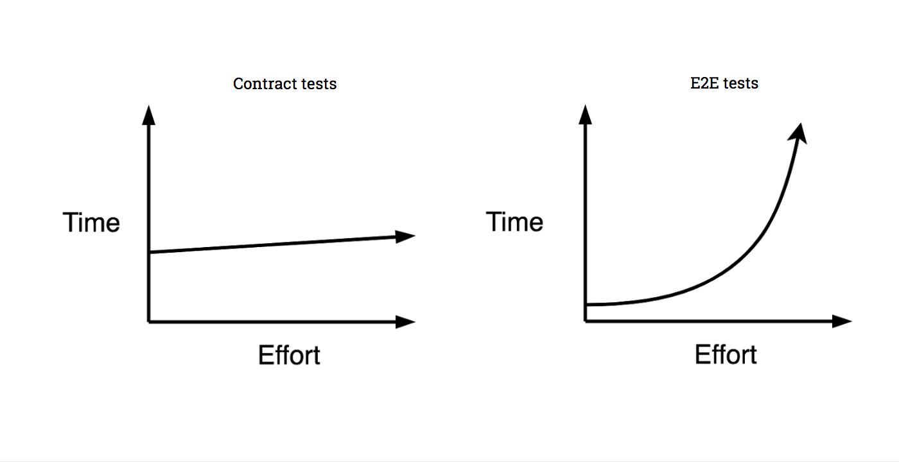

# Convince me

The main thing that any organisation cares about when it comes to software development is cost. When building a product, your time is probably the biggest cost to an organisation. One of the other significant costs is compute resources \(eg. cloud provider, private data centre\). While there will be initial overhead in learning how to use contract tests and integrating them into your build pipeline, using contract tests in conjunction with \(or as a replacement for\) traditional end-to-end integration tests will be cheaper in the long run, for several reasons.

* Contract tests save _development time_ by:
  * providing very fast feedback to developers and testers, and [fast feedback loops speed up software delivery](https://dzone.com/articles/how-to-use-fast-feedback-loops).
  * clearly identifying where the problem is when they fail
  * enabling test failures to be debugged locally on a developer's machine rather than having to rely on system logs.
  * reducing the amount of time spent on test failures caused by environmental issues rather than integration bugs
* Contract tests save _compute time and resources_ by:
  * reducing the number of, or even eliminating, tests that need to run in a deployed environment
  * executing faster than the integration tests they replace
* _Consumer driven_ contract tests save _development time_ by:
  * ensuring that only the parts of the API that will actually be used get developed

Try keeping track of how long your team currently spends on:

* Building and maintaining your test environments
* Writing and executing integration tests
* Debugging integration tests failures
* Fixing flakey integration tests

Wouldn't it be a better use of your time working on fast, reliable tests that allowed you to respond to change quickly, rather than slowing you down?

## What is this contract testing thing?

When compared to E2E testing approaches, contract testing enables you to create consistent curves in your pipeline speed and complexity that look more like the below chart, whilst maintaining many of the safety guarantees of E2E test approaches:

If you want to understand more on the "why", you can read the full article [here](https://blog.pactflow.io/why-contract-testing/).

## How to get started contract testing?

Once you have a grasp of what contract testing is and how it might solve some of your challenges, the next thing is working out how to get started in your environment. [This guide ](https://blog.pactflow.io/why-contract-testing/)will help you start that journey.

## What if I think end-to-end \(E2E\) integration tests are good?

Read the following to un-convince yourself:

* [http://googletesting.blogspot.com.au/2015/04/just-say-no-to-more-end-to-end-tests.html](http://googletesting.blogspot.com.au/2015/04/just-say-no-to-more-end-to-end-tests.html)
* [http://blog.thecodewhisperer.com/permalink/integrated-tests-are-a-scam](http://blog.thecodewhisperer.com/permalink/integrated-tests-are-a-scam)
* and if you're really keen, [Defect Analysis and Prevention for Software Process Quality Improvement](http://www.ijcaonline.org/volume8/number7/pxc3871759.pdf)

Research tells us that integration tests are more costly in terms of time, effort and maintenance without giving us any more guarantees.

## Common Excuses

### ...but we're all on the same team, we don't need to use contracts

You might all be on the same team now but:

* new people join teams and they won't have all the context that your team currently has
* people leave and take their knowledge and practices with them
* organisations get restructured, and product ownership changes
* people are fallible, and communication doesn't always happen, despite everyone's best intent

Something to note - the team that originally wrote Pact was "all on the same team".

### ...but we all follow good engineering practices strictly and only ever make backwards compatible changes

That's great to hear! See above.

### ...but I already have a local Mock Server \(e.g. VCR, MockServer\)

Pact is like VCR in reverse. VCR records actual provider behaviour, and verifies that the consumer behaves as expected. Pact records consumer behaviour, and verifies that the provider behaves as expected. The advantages Pact provides are:

* The ability to develop the consumer \(eg. a Javascript rich client UI\) before the provider \(eg. the JSON backend API\).
* The ability to drive out the requirements for your provider first, meaning you implement exactly and only what you need in the provider.
* Well documented use cases \("Given ... a request for ... will return ..."\) that show exactly how a provider is being used.
* The ability to see exactly which fields each consumer is interested in, allowing unused fields to be removed, and new fields to be added in the provider API without impacting a consumer.
* The ability to immediately see which consumers will be broken if a change is made to the provider API.
* When using the [Pact Broker](https://github.com/pact-foundation/pact_broker), the ability to map the relationships between your services.

See [https://github.com/pact-foundation/pact-ruby/wiki/FAQ\#how-does-pact-differ-from-vcr](https://github.com/pact-foundation/pact-ruby/wiki/FAQ#how-does-pact-differ-from-vcr) for more examples of similar technologies.

### ...but I use Swagger/OpenAPI?

OpenAPIs and Pact are designed with different ends in mind. The differences can be summarised below:

The OpenAPI specification aims to standardise the description and structure of an API. It can tell you what APIs are available and what fields/structure it expects and can generate documentation/UI to interact with one. What it is not \(on its own\) is a testing framework.

Pact on the other hand, is essentially a unit testing framework using _specification by example_. It just so happens that to be able to run those tests on the API consumer and provider side, it needs to generate an intermediate format to be able to communicate that structure - this is the specification.

Just documenting your API with an OAS and sharing it with developer teams will not stop integration bugs happening - but you can use additional tools to enforce OAS compliance on both sides. In fact, the authors of the OpenAPI specification predicted such use cases by announcing:

> Additional utilities can also take advantage of the resulting files, such as testing tools. Potentially, for example, we could use vendor extensions to document this extra metadata that is captured in our spec. This is one way the two projects could come together.

OpenAPI can be used as a contract testing framework in a similar way to Pact if you have an automated way of ensuring _before_ deploying that:

* your specification is an accurate representation of your API \(including all error responses and polymorphic payloads\)
* your consumers only makes requests and expect responses that conform to the specification
* you do not break existing consumer expectations of your API
* changes to the specification are automatically propagated to consumers
* you can coordinate development and deployments such that you only ever deploy compatible versions of your applications into the same environment

If you are using OpenAPI, consider using [Swagger Mock Validator](https://bitbucket.org/atlassian/swagger-mock-validator), a plugin developed at Atlassian that aims to unify these worlds.

Using in combination with Pact gives you confidence your API meets any published specification \(for external clients\), whilst giving you the confidence that any _known_ consumer requirements \(internal\) are satisfied.

See [https://github.com/pact-foundation/pact-specification/issues/28](https://github.com/pact-foundation/pact-specification/issues/28) for more.

Where Pact will really give you an advantage over using Swagger alone is when it comes to making changes to your API. Pact allows you to see the impact of making a change to an API within minutes, and gives you a concrete list of which teams to talk to, and what to discuss. Your tests will show you when the new functionality has been adopted by each consumer, and when any old functionality can be removed. On the other hand, releasing a new version of a Swagger specification and waiting for all the consumer teams \(who may or may not actually use that particular feature\) to respond to those changes could take weeks or months.

### ...but I already have an end-to-end \(E2E\) integration suite?

There are a few key problems with end-to-end \(E2E\) testing:

* E2E tests require you to deploy before you can find the bugs, and deploying takes time. Wouldn't it be better to find the bugs before you deployed?
* E2E tests are slow - slow build times result in batching of changes. Batching is bad for Continuous Delivery
* E2E tests are hard to coordinate. How do you ensure the exact correct versions of _all_ software components are exactly as they should be?
* E2E complexity is non-linear - it gets harder and messier over time.
* Why should you care about how other systems behave?

The litmus test is this: if you can look someone straight in the eyes, and say that you don't spend a lot of time maintaining E2E environments or have constant challenges managing the tests, then it's time for another approach. If you have one or more people dedicated to managing release processes, this is probably a good sign you are heading in the wrong direction.

If you really want to hang onto these, consider pushing a subset of your E2E scenarios further down your pipeline as a type of "Smoke Test", running just a few key scenarios prior to releasing to customers.

_NOTE: Obviously, there is an element of not wanting to throw the baby out with the bathwater here. Please factor accordingly_

### ...but I use Docker?

See "but I already have an E2E integration suite?". All of the problems still exist, but Docker numbs the pain \(or defers it\).

### ...but our company develops APIs before consumers \(e.g. API/Document Driven Design\)

Then you are probably developing for _many consumers_, am I right? If you don't know who these consumers are going to be, then Pact may not be for you. If you have control over any of them, then Pact could be a good fit - you just won't be driving the design from the consumer \(that's OK too\).

### ...but I don't trust you and your dodgy code

Good, you shouldn't. You should evaluate Pact on a smaller project to prove its worthiness before downing the Kool-aid.

In fact, you don't even have to use Pact to implement contract testing and gain the glorious benefits - Pact just makes it easier.

## OK, I'm convinced but I can't convince my friends

Are you just saying that so we don't feel bad?

Here are some suggestions to win them over:

* Watch some of the great talks over lunch with your team and some popcorn
* [Ask](https://slack.pact.io) one of the pact contributors to do a brown-bag talk at your office or over hangouts
* [Chat](https://slack.pact.io) to us in real-time and we'll see if we can debate as your proxy

