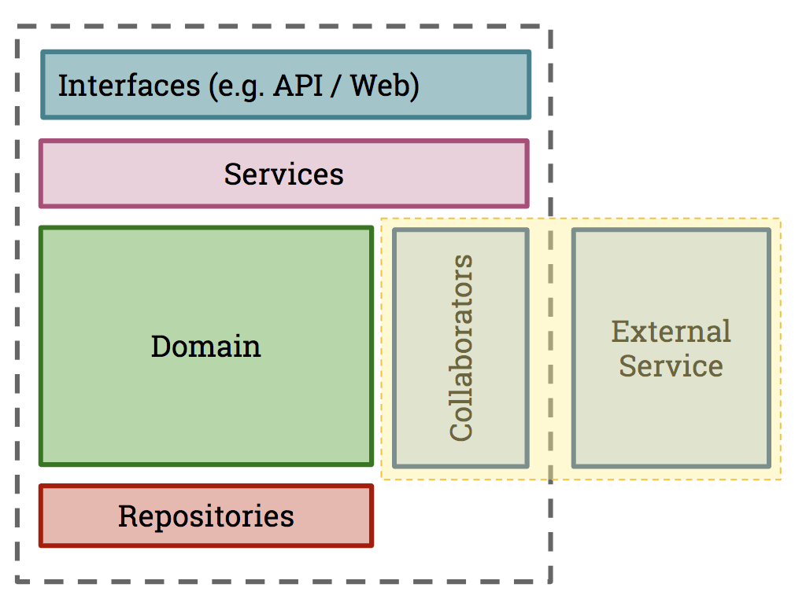

# Testing scope

### Scope of a Consumer Pact Test

Ideally, the Pact tests should be "unit tests" for your client class, and they should just focus on ensuring that the request creation and response handling are correct. If you use pact for your UI tests, you'll end up with an explosion of redundant interactions that will make the verification process tedious. Remember that pact is for testing the contract used for communication, and not for testing particular UI behaviour or business logic.

Usually, your application will be broken down into a number of sub-components, depending on what type of application your consumer is \(e.g. a Web application or another API\). This is how you might visualise the coverage of a consumer Pact test:

Here, a _Collaborator_ is a component whose job is to communicate with another system. In our case, this is the `OrderApiClient`communicating with the external `Order Api` system. This is what we want our consumer test to inspect.

### Scope of a Provider Pact Test

On the Provider side, Pact needs to replay all of the interactions \(usually HTTP requests\) against your service. There are a number of choices that can be made here, but usually these are the choices:

* Invoke just the controller layer \(in an MVC app, or the "Adapter" in our diagram\) and stub out layers beneath
* Choosing a real vs mocked out database
* Choosing to hit mock HTTP servers or mocks for external services

Generally speaking, we test the entire service and mock out external services such as downstream APIs \(which would need their own set of Pact tests\) and databases. This gives you some of the benefits of an integration test without the high costs of maintenance.

This is how you might visualise the coverage of a provider Pact test:

### 

