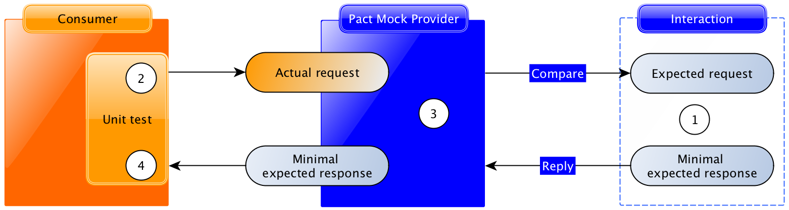
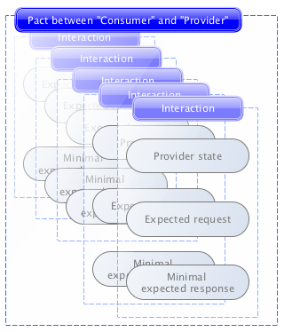
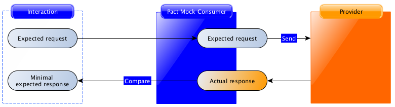
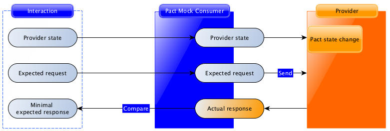
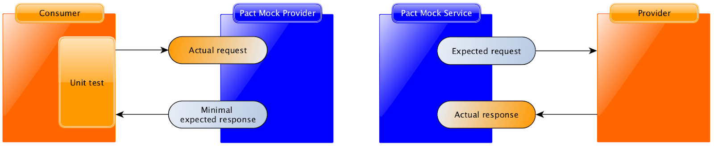

# Pact: A contract testing tool

> noun  
> A formal agreement between individuals or parties. _"the country negotiated a trade pact with the US"_  
> synonyms:	agreement, protocol, deal, contract

Pact is a contract testing tool. Contract testing is a way to ensure that services (such as an API provider and a client) can communicate with each other. Without contract testing, the only way to know that services can communicate is by using expensive and brittle integration tests.

Do you [set your house on fire to test your smoke alarm?](https://dius.com.au/2014/05/19/simplifying-micro-service-testing-with-pacts/) No, you test the contract it holds with your ears by using the testing button. Pact provides that testing button for your code, allowing you to safely confirm that your applications will work together without having to deploy the world first.


### Contract Testing

Contract testing is immediately applicable anywhere where you have two services that need to communicate - such as an API client and a web front-end. Although a single client and a single service is a common use case, contract testing really shines in an environment with many services (as is common for a microservice architecture). Having well-formed contract tests makes it easy for developers to avoid version hell. Contract testing is the killer app for microservice development and deployment.

In general, a contract is between a _consumer_ (for example, a client that wants to receive some data) and a _provider_ (for example, an API on a server that provides the data the client needs). In microservice architectures, the traditional terms _client_ and _server_ are not always appropriate -- for example, when communication is achieved through message queues. For this reason, we stick to _consumer_ and _provider_ in this documentation.

### Consumer Driven Contracts

Pact is a [consumer-driven](http://martinfowler.com/articles/consumerDrivenContracts.html) contract testing tool. This means the contract is written as part of the consumer tests. A major advantage of this pattern is that only parts of the communication that are actually used by the consumer(s) get tested. This in turn means that any provider behaviour not used by current consumers is free to change without breaking tests.

### How a pact test works

A contract between a consumer and provider is called a _pact_. Each pact is a collection of _interactions_. Each interaction describes:

* An expected request - describing what the consumer is expected to send to the provider (this is always present for synchronous interactions like HTTP requests, but not required for asynchronous interactions like message queues)
* a minimal expected response - describing the parts of the response the consumer wants the provider to return.


The first step in writing a pact test is to describe this interaction.

### Consumer testing

Consumer Pact tests operate on each interaction described earlier to say “assuming the provider returns the expected response for this request, does the consumer code correctly generate the request and handle the expected response?”.

Each interaction is tested using the pact framework, driven by the unit test framework inside the consumer codebase:


Following the diagram:



1. Using the Pact DSL, the expected request and response are registered with the mock service.
2. The consumer test code fires a real request to a mock provider (created by the Pact framework).
3. The mock provider compares the actual request with the expected request, and emits the expected response if the comparison is successful.
4. The consumer test code confirms that the response was correctly understood

Pact tests are only successful if each step completes without error.

Usually, the interaction definition and consumer test are written together, such as this example from [this Pact walkthrough guide](https://dius.com.au/2014/05/19/simplifying-micro-service-testing-with-pacts/):

```ruby
# Describe the interaction
before
do     
  event_api.upon_receiving('A POST request with an event').
    with(method: :post, path: '/events', headers: {'Content-Type' => 'application/json'}, body: event_json).
    will_respond_with(status: 200, headers: {'Content-Type' => 'application/json'})
end

# Trigger the client code to generate the request and receive the response
it 'is successful' do
  expect(subject.save_event(event)).to be_true
end
```

Although there is conceptually a lot going on in a pact interaction test, the actual test code is very straightforward. This is a major selling point of Pact.

In Pact, each interaction is considered to be independent. This means that each test only tests one interaction. If you need to describe interactions that depend on each other, you can use _provider states_ to do it. Provider states allow you describe the preconditions on the provider required to generate the expected response - for example, the existence of specific user data. This is explained further in the provider verification section below.


Instead of writing a test that says “create user 123, then log in”, you would write two separate interactions - one that says “create user 123”, and one with provider state “user 123 exists” that says “log in as user 123”.

Once all of the interactions have been tested on the consumer side, the Pact framework generates a _pact file_, which describes each interaction:



This pact file can be used to verify the provider.

### Provider verification

In contrast to the consumer tests, provider verification is entirely driven by the Pact framework:



In provider verification, each request is sent to the provider, and the actual response it generates is compared with the minimal expected response described in the consumer test.

Provider verification passes if each request generates a response that contains at least the data described in the minimal expected response.

In many cases, your provider will need to be in a particular state (such as “user 123 is logged in”, or “customer 456 has an invoice #678”). The Pact framework supports this by letting you set up the data described by the provider state before the interaction is replayed:



### Putting it all together

Here’s a repeat of the two diagrams above:



If we pair the test and verification process for each interaction, the contract between the consumer and provider is fully tested without having to spin up the services together.

### Next steps

*Pact tests should be data independent*. Pact tests are best when successful verification doesn’t depend on the specific data that the provider returns. See this guide for best practices when describing interactions.

*Contract tests are not functional tests*. It can be tempting to use contract tests to test provider behaviour and functionality. Experience shows this to leads to painful experiences with brittle tests. See [this guide for contract testing best practices](https://docs.pact.io/best_practices/contract_tests_not_functional_tests.html).

*Use the broker to integrate Pact with your CI infrastructure.* Integrating Pact with your continuous integration infrastructure is a major win for safe and successful deployment. See this guide for Pact integration best practices


### Why do you want to use Pact

<table>
  <tr>
    <th>Confidence</th>
    <th>Faster turnaround</th>
    <th>Less Error Prone</th>
  </tr>
  <tr>
    <td>
    Continuously evolve your codebase knowing that Pact will guarantee contracts are met.
    </td>
    <td>
      Find out <em>before</em> you deploy whether or not your applications will work together - no need to wait for slow e2e tests.
    </td>
    <td>
    Generation and verification of contracts are automatically managed by Pact.
    </td>
  </tr>
</table>

I still need [convincing](faq/convinceme.html).

### Talks and Presentations

Check out [this talk about Pact](http://www.infoq.com/presentations/pact) and the slides below from one of the Pact authors for an introduction.
<p style="text-align: center;">
<iframe src="https://www.slideshare.net/slideshow/embed_code/key/f4e6DF51EttgzJ" width="595" height="485" frameborder="0" marginwidth="0" marginheight="0" scrolling="no" style="border:1px solid #CCC; border-width:1px; margin-bottom:5px; max-width: 100%;" allowfullscreen> </iframe> <div style="margin-bottom:5px"> <strong> <a href="http://www.slideshare.net/bethesque/pact-44565612" title="Consumer-Driven Contracts with Pact (Sydney API Days 2015)" target="_blank">Consumer-Driven Contracts with Pact (Sydney API Days 2015)</a> </strong> from <strong><a target="_blank" href="http://www.slideshare.net/bethesque">Beth Skurrie</a></strong> </div>
</p>

For a JVM specific talk, [Deploy with Confidence!](https://www.youtube.com/watch?v=h-79QmIV824) was presented at the April meet-up of [MelbJVM](http://www.meetup.com/en-AU/Melbourne-Java-JVM-Users-Group/) and at the June meet-up of
[Melbourne Microservices](http://www.meetup.com/en-AU/Melbourne-Microservices/). Slides for the talk [can be found here](/media/Pact%20-%20Deploy%20with%20Confidence!.pdf).

For a great explanation of consumer-driven contracts (and Pact!), check out this talk from Atlassian at their 2016 summit: [Verifying Microservice Integrations with Contract Testing](https://www.youtube.com/watch?v=-6x6XBDf9sQ&feature=youtu.be).

Hear how Soundcloud ["Move Fast and Consumer-Driven-Contract-Testing Things"](https://speakerdeck.com/alonpeer/move-fast-and-consumer-driven-contract-test-things) in their talk from MicroXchg 2017.

### Implementations
- [Ruby Pact](https://github.com/pact-foundation/pact-ruby)
- [JVM Pact](https://github.com/DiUS/pact-jvm) and [Scala-Pact](https://github.com/ITV/scala-pact)
- [.NET Pact](https://github.com/SEEK-Jobs/pact-net)
- [JS Pact](https://github.com/pact-foundation/pact-js)
- [Go Pact](https://github.com/pact-foundation/pact-go) (there is also a v1.1 native [Pact Go](https://github.com/SEEK-Jobs/pact-go))
- [Swift / Objective-C Pact](https://github.com/DiUS/pact-consumer-swift)
- [Python](https://github.com/pact-foundation/pact-python)
- [PHP](https://github.com/pact-foundation/pact-php)


### Introductory articles

* [Getting started with Pact](https://dius.com.au/2014/05/19/simplifying-micro-service-testing-with-pacts/)
* [...and more!](media/blogs_videos_and_articles.md)


### Getting Help
You can get help on Pact from the following channels:

* **Stack Overflow**: https://stackoverflow.com/questions/tagged/pact
* **Gitter:** Join the chat at https://gitter.im/realestate-com-au/pact and https://gitter.im/DiUS/pact-jvm
* **Twitter:** @pact_up
